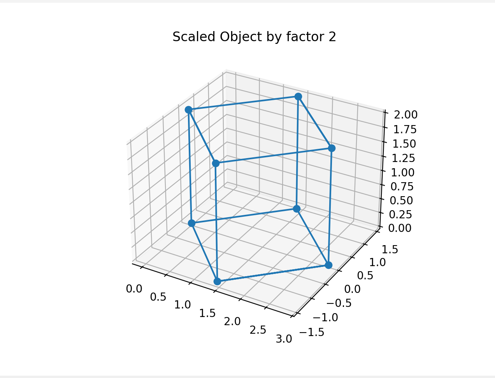
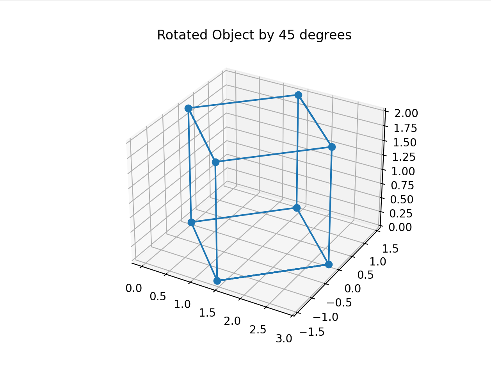

### Answers to the theoretical questions
1. Що таке лінійні трансформації? *(0,25 бала)*
- Це відображення, які зберігають лінійні комбінації векторів. Це означає, що для будь-яких двох векторів `u` та `v` і будь-якого скаляра `a` виконується: `f(a * u + b * v) = a * f(u) + b * f(v)`, де `f` - лінійне відображення.
2. Як і в яких галузях застосовуються лінійні трансформації? *(0,25 бала)*
- Комп'ютерна графіка - для обробки зображень (за допомогою лінійних трансформацій можна змінювати розмір, поворот, зміщення зображення etc.)
- Deep learning/Neural networks - для обробки даних (за допомогою лінійних трансформацій можна змінювати ваги нейронів (attention layer), змінювати архітектуру нейронних мереж etc.)
- Криптографія, обробка сигналів etc.
3. Що таке матриця лінійної трансформації та як її можна інтерпретувати? *(0,25 бала)*
- Це матриця, що "відображає" вектори в нові вектори відповідно до лінійного відображення. Це можна інтерпретувати як базисні вектори, які визначають новий базис векторів у просторі.
4. Які особливості та властивості має матриця обертання? *(0,25 бала)*
- `det(R) == 1` - Determinant матриці обертання дорівнює 1.
- `R^T == R^(-1)` - транспонована матриця обертання дорівнює оберненій матриці обертання.
- `R1 * R2 = R3` - добуток матриць обертання є матрицею обертання.
5. Чи залежить фінальний результат від порядку трансформацій? Провести експерименти з фігурами або зображеннями з частин 1-2.  *(0,25 бала)*
- Результат лінійних трансформацій не залежить від порядку трансформацій. Це можна підтвердити експериментально: 
  1. ```
     def transform_3d_object(obj):
        plot_object_3d(obj, "Initial 3d object")
        rotated_obj = rotate_object_3d(obj, 45)
        scale_object_3d(rotated_obj, 2)
     ```
     результат: 
  2. ```
     def transform_3d_object(obj):
        plot_object_3d(obj, "Initial 3d object")
        scaled_obj = scale_object_3d(obj, 2)
        rotate_object_3d(scaled_obj, 45)
     ```
     результат: 
- Як бачимо, результати однакові
6. Була здійснена якась довільна лінійна трансформація; як знайти матрицю лінійної трансформації, що поверне все до початкового вигляду? Чи завжди можна здійснити обернену трансформацію? *(0,25 бала)*
- В даному випадку треба знайти обернену матрицю, до першої матриці трансформації, і звичайно це можна зробити лише тоді, коли визначник матриці трансформації `!= 0`.
7. Модуль визначника матриці трансформації менше 1, які висновки можна зробити про дану трансформацію (як змінюється простір при даній трансформації)? А якщо більше 1? Дорівнює 1? Дорівнює 0? *(0,5 бала)*
- `< 1`: простір стискається.
- `> 1`: розтягується.
- `== 1`: залишається незмінним.
- `== 0`: простір втрачає розмірність.
